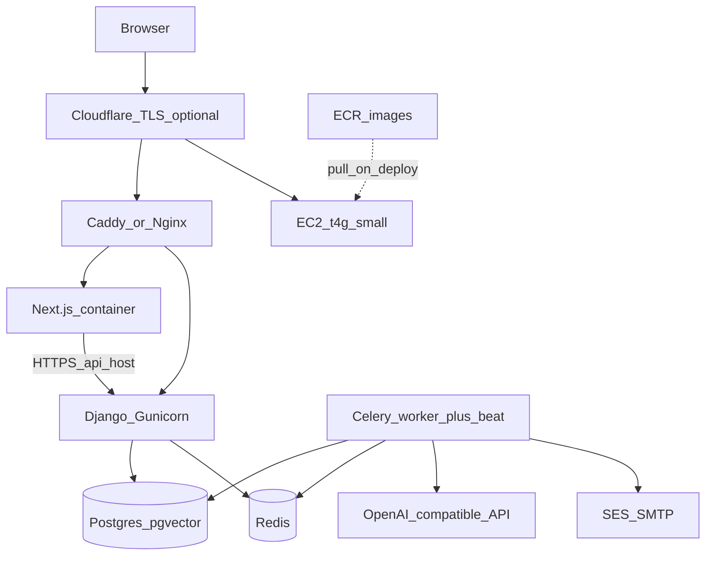
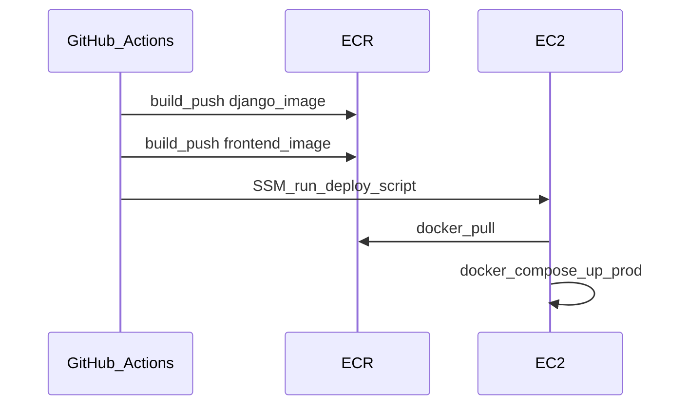

# AWS deployment (first ~100 users)

Infrastructure plan for running NewsPulse in production on AWS at low cost. Target: **~$16–20/month** on `t4g.small` (excluding LLM API usage).

**Approach:** one **`t4g.small` EC2** instance (ARM) running **Docker Compose (prod)** + **ECR** for images + **TLS reverse proxy** (Cloudflare or Caddy). Skip EKS, ALB, RDS, and ElastiCache until you outgrow this box.

Related docs:

- [production-security.md](production-security.md) — prod env checklist, CORS, TLS headers, rate limits
- [environments.md](environments.md) — `NEWSMINE_ENV` and `.env` templates
- [config/env/prod.example](../config/env/prod.example) — production variable template

---

## Summary

| Decision | Choice |
|----------|--------|
| Compute | Single EC2 `t4g.small` (ARM, 2 GiB RAM; `EMBEDDINGS_ENABLED=false`) |
| Orchestration | Docker Compose (prod overlay, not dev bind-mounts) |
| Images | ECR (`newspulse-api`, `newspulse-web`) |
| Database | Postgres 17 + pgvector on the same instance |
| Cache / broker | Redis on the same instance |
| TLS | Cloudflare (free) **or** Caddy + Let's Encrypt on EC2 |
| Email | Amazon SES SMTP |
| **Not used yet** | EKS, ECS Fargate, ALB, RDS, ElastiCache, API Gateway |

---

## Architecture



**Hostnames (example):**

- `https://www.yourdomain.com` → Next.js (`frontend:3000`)
- `https://api.yourdomain.com` → Django Gunicorn (`django:8000`)
- Health: `GET https://api.yourdomain.com/health/`

The browser calls the API on the **public API hostname** (`NEXT_PUBLIC_API_URL`), not Docker internal names.

---

## Why not EKS / serverless / API Gateway (for now)

| Option | Verdict |
|--------|---------|
| **EKS** | ~$73/mo control plane alone + nodes; heavy ops. Overkill for ~100 users. |
| **Lambda + API Gateway** | Poor fit: long-running Celery, beat schedules, local PyTorch embeddings in the API image. |
| **App Runner** | OK for one web container; still need an always-on Celery worker + model cache volume. |
| **ECS Fargate + RDS + ALB** | Good **phase 2** (~$90–130/mo). Use after validating on a single box. |

**ECR** is still recommended: push pre-built slim API images from CI (no PyTorch in the default image).

**API Gateway:** skip initially. Terminate TLS at Cloudflare or Caddy; Django already applies per-IP/user rate limits (see [production-security.md](production-security.md)).

---

## Services on the box

| Compose service | Production | Notes |
|-----------------|------------|-------|
| `django` | Yes | Expose only via reverse proxy |
| `frontend` | Yes | Build with prod `NEXT_PUBLIC_*` (see below) |
| `celery` | Yes | Scrape/cluster/summarize only (no PyTorch in slim image) |
| `celerybeat` | Yes | Exactly one beat instance |
| `postgres` | Yes | pgvector via [docker/postgres/init-pgvector.sql](../docker/postgres/init-pgvector.sql) |
| `redis` | Yes | Celery broker + Django cache |
| `flower` | No | Do not expose to the internet (or VPN-only) |
| `metabase` | No | Saves ~512MB–1GB RAM; use later if needed |

Base reference: [docker-compose.yml](../docker-compose.yml) (dev). Production uses [docker-compose.prod.yml](../docker-compose.prod.yml).

---

## Instance and networking

### EC2

- **Type (default):** `t4g.small` (2 vCPU, 2 GiB), e.g. `ap-south-1` (Mumbai) — fits scrape + cluster + summarize with `EMBEDDINGS_ENABLED=false` (default).
- **With embeddings:** upgrade to `t4g.medium` (4 GiB) or run `celery-embeddings` on a separate instance/profile.
- **Disk:** 30–40 GiB gp3 root (Postgres + `model_cache` for Hugging Face model)
- **Elastic IP:** stable DNS target (small charge if instance is stopped)

### Security group

| Port | Access |
|------|--------|
| 22 | Your IP only, **or** disable SSH and use SSM Session Manager |
| 80, 443 | `0.0.0.0/0` (or Cloudflare IP ranges if proxied) |
| 5432, 6379, 3000, 8000, 5555 | **Not** public |

### VPC

Default VPC + public subnet is fine for a first deploy.

### TLS (pick one)

**A — Cloudflare (simplest, $0):** Proxy `www` and `api` to the EC2 IP; SSL mode “Full (strict)”; origin serves HTTPS (Caddy/Nginx + origin cert).

**B — Caddy on EC2:** Automatic Let's Encrypt for both hostnames; no ALB.

Proxy must send `X-Forwarded-Proto: https` and correct `Host` for Django `SECURE_SSL_REDIRECT` (see [production-security.md](production-security.md)).

---

## ECR and deploy flow



1. **ECR repositories:** `newspulse-api`, `newspulse-web` (tags: git `sha` + `latest`)
2. **Build frontend in CI** with:
   - `NEXT_PUBLIC_NEWSMINE_ENV=prod`
   - `NEXT_PUBLIC_API_URL=https://api.yourdomain.com/api`
3. **EC2 IAM role:** `ecr:GetAuthorizationToken`, `ecr:BatchGetImage`, `ssm:UpdateInstanceInformation`
4. **Deploy on instance:**
   ```bash
   aws ecr get-login-password --region <region> | docker login ...
   docker compose -f docker-compose.prod.yml pull
   docker compose -f docker-compose.prod.yml up -d
   docker exec np-django python manage.py migrate
   ```

Frontend image must be rebuilt whenever `NEXT_PUBLIC_*` changes.

---

## Production environment

Copy [config/env/prod.example](../config/env/prod.example) to `.env` on the server (never commit).

| Variable | Example |
|----------|---------|
| `NEWSMINE_ENV` | `prod` |
| `DJANGO_ALLOWED_HOSTS` | `api.yourdomain.com` |
| `CORS_ALLOWED_ORIGINS` | `https://www.yourdomain.com` |
| `BASE_URL` | `https://api.yourdomain.com` |
| `NEXT_PUBLIC_API_URL` | `https://api.yourdomain.com/api` (build-time for frontend image) |
| `DATABASE_HOST` | `postgres` (compose service name) |
| `CELERY_BROKER_URL` | `redis://redis:6379/0` |
| `REDIS_URL` | `redis://redis:6379/1` |
| `OPENAI_COMPATIBLE_*` | Hosted API (OpenRouter, etc.) — not `host.docker.internal` |
| `EMAIL_*` | Amazon SES SMTP credentials |

Full checklist: [production-security.md](production-security.md).

---

## AWS services checklist

| Service | Use |
|---------|-----|
| EC2 `t4g.small` | Full stack (no local embeddings) |
| ECR | API + web images |
| Elastic IP | Stable DNS |
| Route53 | Optional hosted zone (~$0.50/mo) |
| SES | Digest / auth email |
| S3 | Optional tab placeholder images (`PLACEHOLDER_BASE_URL` in prod.example) |
| Secrets Manager | Optional instead of plain `.env` on disk |
| CloudWatch | CPU/disk alarms; container logs |

**Defer:** EKS, ALB (~$16/mo fixed), RDS, ElastiCache, API Gateway, WAF.

---

## Monthly cost estimate (`ap-south-1`, Mumbai)

| Item | ~USD/mo |
|------|---------|
| `t4g.small` | ~12 |
| 40 GiB gp3 | 3 |
| ECR (2 images) | 1–2 |
| SES (low volume) | 0 |
| Cloudflare | 0 |
| **Infra subtotal** | **~16–20** |
| LLM API (OpenRouter, etc.) | usage-based |

---

## Operational notes

1. **Embeddings (optional):** disabled by default (`EMBEDDINGS_ENABLED=false`). To backfill vectors, set `EMBEDDINGS_ENABLED=true` and start the compose profile: `docker compose --profile embeddings up -d celery-embeddings`. First run downloads the model into `model_cache` (`EMBEDDING_MODEL_PATH=/data/embeddings-models`); avoid multiple embed workers on 4 GiB RAM.
2. **Celery beat:** run a single `celerybeat` container.
3. **Post-deploy checks:** Swagger 404, CORS preflight, `/health/`, no public Postgres/Redis — see [production-security.md](production-security.md).
4. **Backups:** daily `pg_dump` to S3 via cron, or weekly EBS snapshots; retain ~7 days and test a restore once.

---

## Deploy cheatsheet (logs & debugging)

Run these on the EC2 instance from the app directory (default **`/opt/newspulse`**). Replace domains with your `CADDY_DOMAIN_*` values.

### Access the box

```bash
# SSH (if port 22 open)
ssh -i your-key.pem ec2-user@<elastic-ip>

# Or SSM (no SSH) — from laptop with AWS CLI
aws ssm start-session --target <instance-id> --region ap-south-1
```

### Stack status

```bash
cd /opt/newspulse
docker compose -f docker-compose.prod.yml ps
docker compose -f docker-compose.prod.yml ps -a    # include exited
docker stats --no-stream                            # CPU/RAM per container
df -h                                             # disk (Postgres + model cache)
free -h                                           # host memory
```

| Container | Role |
|-----------|------|
| `np-caddy` | TLS + routes `www` → frontend, `api` → django |
| `np-frontend` | Next.js |
| `np-django` | Gunicorn / Django |
| `np-celery` | Worker (`celery`, `digest` queues) |
| `np-celerybeat` | Scheduled tasks (exactly one) |
| `np-celery-embeddings` | Optional (`--profile embeddings`) |
| `np-postgres` | Postgres 17 + pgvector |
| `np-redis` | Broker + cache |

### Read logs

```bash
COMPOSE="docker compose -f docker-compose.prod.yml"

# All services (last 100 lines, follow)
$COMPOSE logs --tail=100
$COMPOSE logs -f

# One service (compose name)
$COMPOSE logs -f django
$COMPOSE logs -f caddy
$COMPOSE logs -f celery
$COMPOSE logs -f celerybeat
$COMPOSE logs -f frontend

# By container name (same containers, explicit)
docker logs -f --tail=200 np-django
docker logs -f --tail=200 np-caddy
docker logs -f --tail=200 np-celery
docker logs -f --tail=200 np-celerybeat
docker logs -f --tail=200 np-frontend
docker logs -f --tail=200 np-postgres
docker logs -f --tail=200 np-redis
```

Celery also writes files inside the worker container:

```bash
docker exec np-celery tail -f /var/log/celery/worker.log
docker exec np-celerybeat tail -f /var/log/celery/beat.log
```

### Quick health checks (from EC2 or laptop)

```bash
# Load .env for hostnames
source /opt/newspulse/.env

curl -fsS "https://${CADDY_DOMAIN_API}/health/" && echo OK
curl -fsS "https://${CADDY_DOMAIN_WWW}/" -o /dev/null && echo OK

# Full scripted checks
./deploy/smoke-test.sh
```

From **inside** the compose network (bypasses Caddy/DNS):

```bash
docker exec np-django curl -fsS http://127.0.0.1:8000/health/
docker exec np-frontend wget -qO- http://127.0.0.1:3000/ | head
```

### Django / database

```bash
docker exec -it np-django python manage.py check
docker exec np-django python manage.py migrate --plan
docker exec np-django python manage.py migrate --noinput
docker exec -it np-django python manage.py createsuperuser
docker exec -it np-django python manage.py shell

# Postgres shell
docker exec -it np-postgres psql -U "$POSTGRES_USER" -d "$POSTGRES_DB"
# (or set user/db from .env: newspulse / newspulse)

docker exec np-redis redis-cli ping
```

### Celery

```bash
docker exec np-celery celery -A core inspect ping
docker exec np-celery celery -A core inspect active
docker exec np-celery celery -A core inspect registered
```

Pipeline details: [celery-pipeline.md](celery-pipeline.md).

### Restart / redeploy

```bash
cd /opt/newspulse
./deploy/deploy.sh                    # ECR login, pull, up, migrate

# Restart one service without full deploy
docker compose -f docker-compose.prod.yml restart django
docker compose -f docker-compose.prod.yml restart caddy celery celerybeat

# Recreate after .env change (no new image)
docker compose -f docker-compose.prod.yml up -d --force-recreate django celery celerybeat caddy
```

### Common problems

| Symptom | What to check |
|---------|----------------|
| **502 / 521 (Cloudflare)** | `docker ps` — is `np-caddy` up? SG allows 80/443? DNS A records → Elastic IP? |
| **SSL / certificate errors** | `docker logs np-caddy` — ACME failures? `CADDY_DOMAIN_*` must match DNS. Cloudflare SSL = **Full (strict)**. Ports 80+443 must reach EC2 for HTTP-01. |
| **`pull access denied` / ECR** | Instance IAM role has ECR pull policy; `aws ecr get-login-password \| docker login …`; `ECR_*_IMAGE` URIs match region/account. |
| **502 from Caddy, django healthy** | `docker logs np-caddy`; confirm `np-django` / `np-frontend` are running and on the same compose network. |
| **API 400 / DisallowedHost** | `.env`: `DJANGO_ALLOWED_HOSTS=api.yourdomain.com` (no scheme, no trailing slash). |
| **CORS errors in browser** | `CORS_ALLOWED_ORIGINS=https://www.yourdomain.com` must match the **www** origin exactly. |
| **Frontend hits wrong API** | `NEXT_PUBLIC_API_URL` is **build-time** — rebuild and push `newspulse-web`, then `./deploy/deploy.sh`. |
| **Migrations failed** | `docker logs np-django`; run `docker exec np-django python manage.py migrate --noinput` manually. |
| **Celery tasks not running** | `docker logs np-celery`, `np-celerybeat`; `celery inspect ping`; Redis: `docker exec np-redis redis-cli ping`. |
| **Out of memory / OOM** | `dmesg \| tail`; `docker stats`; disable embeddings or upgrade to `t4g.medium`. |
| **Disk full** | `df -h`; `docker system df`; prune old images: `docker image prune -a` (careful on prod). |

### Inspect config (safe)

```bash
cd /opt/newspulse
grep -E '^(CADDY_|DJANGO_ALLOWED|CORS_|BASE_URL|ECR_|NEXT_PUBLIC)' .env
docker compose -f docker-compose.prod.yml config   # resolved compose (no secrets printed from env_file)
```

### ECR / image debugging

```bash
source /opt/newspulse/.env
aws ecr describe-images --repository-name newspulse-api --region "$AWS_REGION" --query 'imageDetails[*].imageTags' --output table
docker images | grep newspulse
docker inspect np-django --format '{{.Config.Image}}'
```

---

## Scaling path (when to leave the single box)

Migrate incrementally (~500+ users or HA needs):

1. **RDS PostgreSQL** (pgvector) — data off the instance
2. **ElastiCache Redis** — broker/cache managed
3. **ECS Fargate + one ALB** — host rules for `api` / `www`; still skip EKS until you need Kubernetes-specific tooling

---

## Implementation checklist

Repo artifacts (run on EC2 / in CI):

- [x] `docker-compose.prod.yml` — ECR images, Caddy, no Flower/Metabase, internal DB/Redis
- [x] `deploy/Caddyfile` — hostname routing, forwarded headers
- [x] `deploy/bootstrap-ec2.sh` — Docker, Compose v2, AWS CLI, SSM agent
- [x] GitHub Actions — [`.github/workflows/deploy-ecr.yml`](../.github/workflows/deploy-ecr.yml) (API); frontend repo has web workflow
- [x] `deploy/aws-foundation.sh` — ECR repos, security group, IAM instance profile (run locally with AWS CLI)
- [x] `deploy/cloudflare-ses.md` — DNS + SES + `.env` checklist
- [x] `deploy/deploy.sh` — pull, up, migrate
- [x] `deploy/smoke-test.sh` — health, Swagger off, Celery ping
- [x] `deploy/pg-dump-s3.sh` + `setup-backup-cron.sh` + `setup-cloudwatch-alarm.sh`
- [x] Optional SSM deploy — [`.github/workflows/deploy-ssm.yml`](../.github/workflows/deploy-ssm.yml)

**You still run manually:** launch EC2 + Elastic IP, point Cloudflare, fill `.env`, first `createsuperuser`, seed, and smoke test in the browser.

See [deploy/README.md](../deploy/README.md) for the step-by-step runbook.
