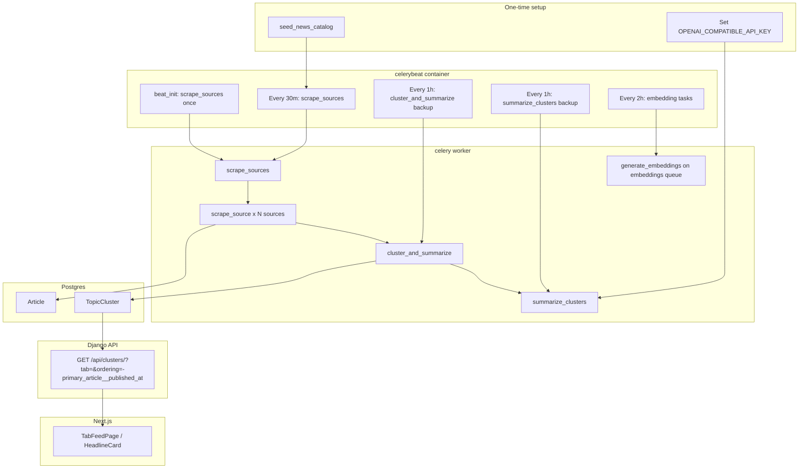

# Celery pipeline: scrape → cluster → summarize → feed

This document describes how NewsPulse **fetches news in the background** and how that data reaches the **tab feed in the UI**. The UI does **not** list raw `Article` rows; it lists **`TopicCluster`** rows with an AI-written digest (`summary`) grouped by story.

Related docs:

- [seed-tabs-and-sources.md](seed-tabs-and-sources.md) — step 1 (tabs + RSS sources in Postgres)
- [flower-celery-monitoring.md](flower-celery-monitoring.md) — Flower UI, manual task triggers

---

## End-to-end flow



**Important:** A new RSS item is stored as an `Article` immediately after scrape, but it **does not appear in the feed** until:

1. `cluster_and_summarize` creates a `TopicCluster` for it (or groups it with similar articles), and  
2. `summarize_clusters` fills `TopicCluster.summary` (requires a working LLM API key).

The list API filters out clusters with an empty `summary`.

---

## First-time setup (full process)

Run from `news-pulse-backend/` (where `docker-compose.yml` lives).

### 1. Start infrastructure and workers

```bash
docker compose up -d postgres redis django celery celerybeat
```

Optional monitoring: `docker compose up -d flower` (http://127.0.0.1:5555).

You need **both** `celery` (worker) and `celerybeat` (scheduler). Starting only `django` will not fetch news.

### 2. Rebuild after pulling pipeline changes

`articles/` and `core/` are **baked into the image** (only `./worker` is bind-mounted). After updating pipeline or API code:

```bash
docker compose build django celery celerybeat
docker compose up -d django celery celerybeat
```

### 3. Seed tabs and sources

```bash
docker compose exec django python manage.py seed_news_catalog
```

See [seed-tabs-and-sources.md](seed-tabs-and-sources.md). This does **not** fetch articles.

Verify:

```bash
docker compose exec django python manage.py shell -c \
  "from articles.models import Source; print('active_sources', Source.objects.filter(active=True).count())"
```

Expect a non-zero count (typically ~40 sources across tabs).

### 4. Configure summarization (required for UI feed)

Summaries use an **OpenAI-compatible HTTP API** (OpenRouter by default). The env names say “compatible” because the key is **not** tied to OpenAI only — your **OpenRouter** key (`sk-or-v1-…`) goes here.

Set in `news-pulse-backend/.env` (Compose reads this file for `${…}` substitution):

| Variable | Purpose |
|----------|---------|
| `OPENAI_COMPATIBLE_API_KEY` | **Required.** Your OpenRouter (or OpenAI) API key |
| `OPENAI_COMPATIBLE_BASE_URL` | API base URL (default `https://openrouter.ai/api/v1`) |
| `OPENAI_COMPATIBLE_MODEL` | Model id on that gateway (prod default: `meta-llama/llama-3.1-8b-instruct`) |
| `SUMMARIZE_MAX_TOKENS` | Max completion tokens per summary (default `180`) |
| `SUMMARIZE_FETCH_FULL_BODY` | Fetch article pages when RSS text is thin (default `false` in prod) |
| `EMBEDDINGS_ENABLED` | Run local embedding jobs (default `false`; saves worker RAM) |

**Legacy names** (still work via fallback in `core/settings.py` and Compose): `OPENAI_API_KEY`, `OPENAI_BASE_URL`, `OPENAI_MODEL`.

Example `.env` for OpenRouter:

```bash
OPENAI_COMPATIBLE_API_KEY=sk-or-v1-your-key-here
OPENAI_COMPATIBLE_BASE_URL=https://openrouter.ai/api/v1
OPENAI_COMPATIBLE_MODEL=meta-llama/llama-3.1-8b-instruct
EMBEDDINGS_ENABLED=false
SUMMARIZE_FETCH_FULL_BODY=false
SUMMARIZE_MAX_TOKENS=180
```

Check whether a key is set **without printing it**:

```bash
# Host .env
grep -E '^OPENAI_COMPATIBLE_API_KEY=|^OPENAI_API_KEY=' .env | sed 's/=.*/=<set>/'

# Inside worker (after compose up)
docker compose exec celery python -c \
  "from django.conf import settings; k=settings.OPENAI_COMPATIBLE_API_KEY; \
   print('key_configured', bool(k), 'prefix', (k[:10]+'…') if len(k)>10 else 'empty')"
```

Without a valid key, clusters can exist with `summary=""` and the **feed stays empty**. After adding or changing the key, restart `celery` and `celerybeat`.

### 5. Let the pipeline run (or trigger manually)

On **Beat startup**, one `scrape_sources` task is enqueued automatically (`beat_init` in `core/celery.py`). Beat also schedules scrapes every **30 minutes**.

Manual full cycle:

```bash
docker compose exec django python manage.py shell -c \
  "from worker.tasks import scrape_sources; print(scrape_sources.delay())"
```

Or from Celery CLI inside a container:

```bash
docker compose exec django celery -A core call worker.tasks.scrape_sources
```

Backfill summaries for clusters already in the DB:

```bash
docker compose exec django python manage.py shell -c \
  "from worker.tasks import summarize_clusters; summarize_clusters.delay()"
```

### 6. Confirm data and API

```bash
docker compose exec django python manage.py shell -c \
  "from articles.models import Article, TopicCluster; \
   print('articles', Article.objects.count()); \
   print('clusters', TopicCluster.objects.count()); \
   print('clusters_with_summary', TopicCluster.objects.exclude(summary='').count())"
```

```bash
curl -s "http://127.0.0.1:8000/api/clusters/?tab=india&ordering=-primary_article__published_at" | head -c 500
```

Open the frontend (http://127.0.0.1:3000) — the India tab should show headline cards with digest text, newest stories first.

---

## What each Celery task does

| Task | Module | What it does |
|------|--------|----------------|
| `scrape_sources` | `worker.tasks` | Loads all `Source` with `active=True`, runs a **chord**: parallel `scrape_source` per source, then `cluster_and_summarize` when all finish |
| `scrape_source` | `worker.tasks` | Fetches one outlet (RSS `content:encoded` or web listing), joins listing paragraphs, optionally fetches each article URL for full body (`worker/article_content.py`), dedupes by URL, creates `Article` rows |
| `cluster_and_summarize` | `worker.tasks` | Groups recent unclustered articles (48h window) into `TopicCluster` by tab + title/content similarity; dispatches `summarize_clusters` if new clusters were created |
| `summarize_clusters` | `worker.tasks` | OpenRouter LLM (`meta-llama/llama-3.1-8b-instruct` in prod): fills empty `TopicCluster.summary` (~60–80 words). Single-source clusters with ≥80 words of body use an excerpt (no API call). Multi-source clusters send up to one related article in the prompt. |
| `generate_embeddings_task` | `worker.tasks` | Local sentence-transformers → `Article.embedding` (only when `EMBEDDINGS_ENABLED=true`) |
| `generate_cluster_embeddings_task` | `worker.tasks` | Embeds cluster text onto primary article vectors (only when `EMBEDDINGS_ENABLED=true`) |
| `run_full_pipeline` | `worker.tasks` | Manual: `scrape_sources` chord; embed tasks only if `EMBEDDINGS_ENABLED=true` |
| `generate_daily_digest_task` | `digest.tasks` | Email digest from recent clusters to subscribers |

**Scraper overrides:** For some source names, `worker.tasks.SCRAPER_CONFIGS` overrides URL and `source_type` from the DB (see seed command comments).

---

## Beat schedule

Defined in `core/celery.py` (merged with `CELERY_BEAT_SCHEDULE` in `core/settings.py`). Timezone: `Asia/Kolkata`.

| Beat key | Task | Interval |
|----------|------|----------|
| *(startup)* | `scrape_sources` | Once when Beat starts |
| `scrape-every-30-minutes` | `scrape_sources` | 30 minutes |
| `cluster-every-hour` | `cluster_and_summarize` | 1 hour (safety net) |
| `summarize-clusters` | `summarize_clusters` | 1 hour (backup) |
| `embed-every-2-hours` | `generate_embeddings_task` | 2 hours (only if `EMBEDDINGS_ENABLED=true`) |
| `embed-clusters-every-2-hours` | `generate_cluster_embeddings_task` | 2 hours (only if `EMBEDDINGS_ENABLED=true`) |
| `daily-digest` | `generate_daily_digest_task` | 24 hours |

---

## Worker queues

The default worker uses `-Q celery,digest` (no `embeddings` queue — keeps PyTorch off the main worker).

- **celery** — scrape, cluster, summarize (time-sensitive)
- **digest** — daily email digest
- **embeddings** — optional; uses Docker target `embeddings` (`docker compose --profile embeddings up celery-embeddings`). See [docker-images.md](docker-images.md).

Embedding work should not block scrapes on the default queue.

---

## How the UI gets stories

| Layer | Behaviour |
|-------|-----------|
| Frontend | `fetchClusters(tab)` → `GET /api/clusters/?tab=…&ordering=-primary_article__published_at` |
| Backend | `TopicClusterViewSet` — only clusters with non-empty `summary`; ordered by primary article publish time (newest first) |
| Display | `HeadlineCard` shows `primary_title`, `summary` digest, `published_at` (falls back to `created_at`) |

Raw articles are available at `GET /api/articles/` but the main feed does not use them.

---

## Verify and monitor

```bash
# Services must be Up
docker compose ps celery celerybeat django

# Beat scheduling (may log to file inside container)
docker compose logs -f celerybeat

# Worker pipeline
docker compose logs -f celery | grep -iE 'scrape|cluster|summar|error'

# Redis queue depth (should usually be 0 if worker keeps up)
docker compose exec redis redis-cli LLEN celery
```

Flower does **not** show Beat cron definitions; use this doc and Beat logs. See [flower-celery-monitoring.md](flower-celery-monitoring.md) for manual task triggers and task history.

---

## Troubleshooting

| Symptom | Likely cause | What to do |
|---------|----------------|------------|
| No new articles ever | `celery` or `celerybeat` not running | `docker compose up -d celery celerybeat` |
| Articles in DB, empty UI | No `TopicCluster.summary` | Set `OPENAI_COMPATIBLE_API_KEY` (OpenRouter key), restart celery, run `summarize_clusters.delay()` |
| Articles in DB, no clusters | Cluster task not run | Run `scrape_sources` or `cluster_and_summarize` manually; check worker logs |
| Long wait after `compose up` | Old behaviour: first scrape at 30m | Rebuild images; Beat now enqueues scrape on startup |
| Tasks pile up in Redis | Worker down or stuck on embed | Check `docker compose logs celery`; worker must consume `embeddings` queue |
| Code changes have no effect | Image not rebuilt | `docker compose build django celery celerybeat` |
| `just-for-you` tab empty | No sources on that tab | Expected — personalized API is separate (`/api/personalized-clusters/`) |

---

## Code references

| Area | Path |
|------|------|
| Beat schedule + startup scrape | `core/celery.py` |
| Task implementations | `worker/tasks.py` |
| Cluster API / feed filter & sort | `articles/views.py` |
| Models | `articles/models.py` (`Article`, `TopicCluster`, `Source`, `Tab`) |
| Compose services | `docker-compose.yml` |
| Frontend client | `news-pulse-frontend/src/lib/api.ts` |
