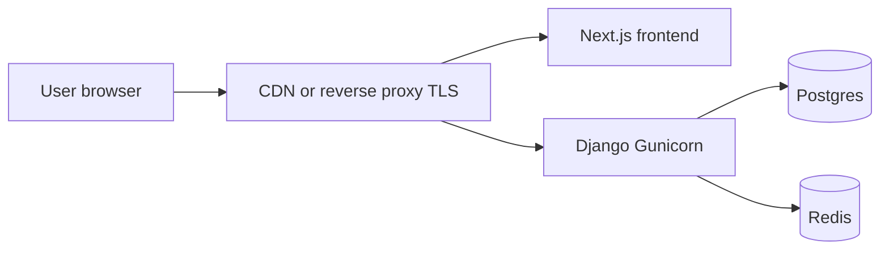

# Production security

How NewsPulse separates dev convenience from production hardening, and what to configure before exposing the site publicly.

## Dev vs production

| Concern | Development | Production (`NEWSMINE_ENV=prod`) |
|--------|-------------|----------------------------------|
| Docker API/UI ports | `127.0.0.1` only in base [docker-compose.yml](../docker-compose.yml) | Do not publish DB/Redis/Flower; use a reverse proxy for HTTPS |
| LAN / phone testing | Optional [docker-compose.lan.example.yml](../docker-compose.lan.example.yml) → `docker-compose.override.yml` (gitignored); opens **Django + Frontend only**, not Postgres/Redis | Not used |
| macOS `localhost` vs `127.0.0.1` | Base bind is IPv4 loopback; use **http://127.0.0.1:3000** if `http://localhost:3000` hangs | N/A |
| Next.js HMR (`allowedDevOrigins`) | Only when `NODE_ENV=development` or `NEXT_PUBLIC_NEWSMINE_ENV=dev` | Disabled in production builds |
| Swagger `/api/docs/` | Enabled when `NEWSMINE_ENV=dev` | Disabled |
| `DJANGO_DEBUG` | May be `true` | Forced `false`; startup fails if misconfigured |
| HTTPS cookies / HSTS | Off | On when `NEWSMINE_ENV` is `prod` or `staging` |
| Chat `POST /api/messages/send/` | Requires JWT | Requires JWT + rate limit |
| `POST /api/digest/resend/` | Staff/admin only | Staff/admin only |

Local secrets in `.env` and `news-pulse-frontend/.env.local` are gitignored and never deployed as-is.

## Production checklist

Copy [config/env/prod.example](../config/env/prod.example) to `.env` and set every value:

- [ ] `NEWSMINE_ENV=prod`
- [ ] `DJANGO_DEBUG=false` (enforced in code even if set wrong)
- [ ] `DJANGO_SECRET_KEY` — unique random string, **at least 50 characters**, not a dev default
- [ ] `DJANGO_ALLOWED_HOSTS` — your API hostname only (e.g. `api.example.com`), no `*`, no `0.0.0.0`
- [ ] `CORS_ALLOWED_ORIGINS` — `https://` frontend origin only (e.g. `https://www.example.com`)
- [ ] `BASE_URL` — public API base URL with `https://`
- [ ] `NEXT_PUBLIC_API_URL` — `https://api.example.com/api` when building the frontend image
- [ ] Strong `POSTGRES_PASSWORD`, `FLOWER_USER` / `FLOWER_PASS` if Flower is used at all
- [ ] TLS terminated at reverse proxy (Caddy, Nginx, or Cloudflare) with `X-Forwarded-Proto: https`
- [ ] Firewall: public internet only on **443** (and 80 → redirect); no direct exposure of 5432, 6379, 8000, 5555
- [ ] Do not deploy Flower to the public internet (or restrict via VPN + strong auth)
- [ ] Verify Swagger is off: `GET /api/docs/` should 404

## Recommended deployment shape



- Run Django/Celery on a private network; only the reverse proxy is reachable from the internet.
- Use `docker compose` with production `.env`, not dev defaults from compose fallbacks.
- Rebuild the frontend after changing `NEXT_PUBLIC_*` variables.
- Point HTTP health checks at `GET /health/` (exempt from `SECURE_SSL_REDIRECT`). Set `SECURE_SSL_REDIRECT=false` only if probes cannot use HTTPS.

## API abuse controls (implemented)

- **Read feeds** (`GET /api/clusters/`, articles): public, throttled per IP (`anon` rate).
- **Chat send**: authenticated + `chat_send` scope (60/hour per user).
- **Auth register/login**: `auth` scope (30/hour per IP).
- **Digest subscribe**: `digest_subscribe` scope (10/hour per IP).
- **Digest resend**: Django staff (`IsAdminUser`) only.

## Verify after deploy

```bash
# Settings load (from app container)
docker exec np-django python -c "from django.conf import settings; print(settings.NEWSMINE_ENV, settings.DEBUG)"

# CORS preflight from your frontend origin (must allow x-device-id)
curl -sI -X OPTIONS \
  -H "Origin: https://www.example.com" \
  -H "Access-Control-Request-Method: POST" \
  -H "Access-Control-Request-Headers: content-type,x-device-id" \
  "https://api.example.com/api/messages/send/"
# expect Access-Control-Allow-Headers to include x-device-id

# Swagger disabled
curl -s -o /dev/null -w "%{http_code}" "https://api.example.com/api/docs/"
# expect 404
```

## LAN / phone testing (dev only)

1. Run `./scripts/dev-host.sh` from the workspace root and set `NEWSMINE_DEV_HOST` in `news-pulse-backend/.env` to the suggested mDNS name (e.g. `YourMac.local`), not the raw LAN IP.
2. Mirror that host in `news-pulse-frontend/.env.local` (`NEXT_PUBLIC_API_URL`, `ALLOWED_DEV_ORIGINS`).
3. Optional: `cp docker-compose.lan.example.yml docker-compose.override.yml` to bind ports on all interfaces.
4. Recreate containers: `docker compose up -d --force-recreate django frontend`.

For Next.js on a phone (host dev server instead of Docker UI):

```bash
cd news-pulse-frontend
npm run dev -- -H 0.0.0.0 -p 3000
```

Use `ALLOWED_DEV_ORIGINS=YourMac.local` (hostname only, no port). See [config/env/lan.example](../config/env/lan.example).
